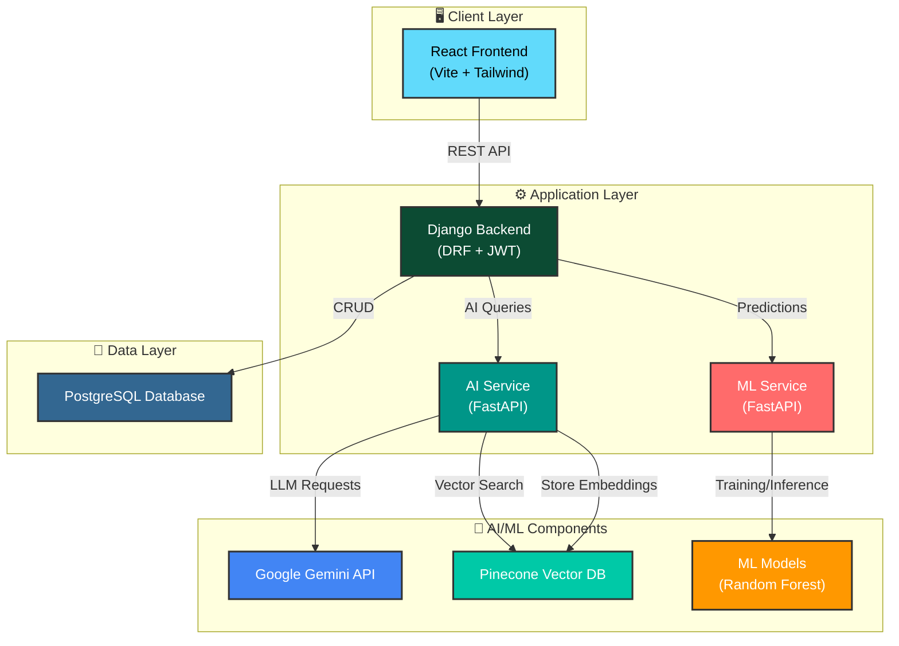
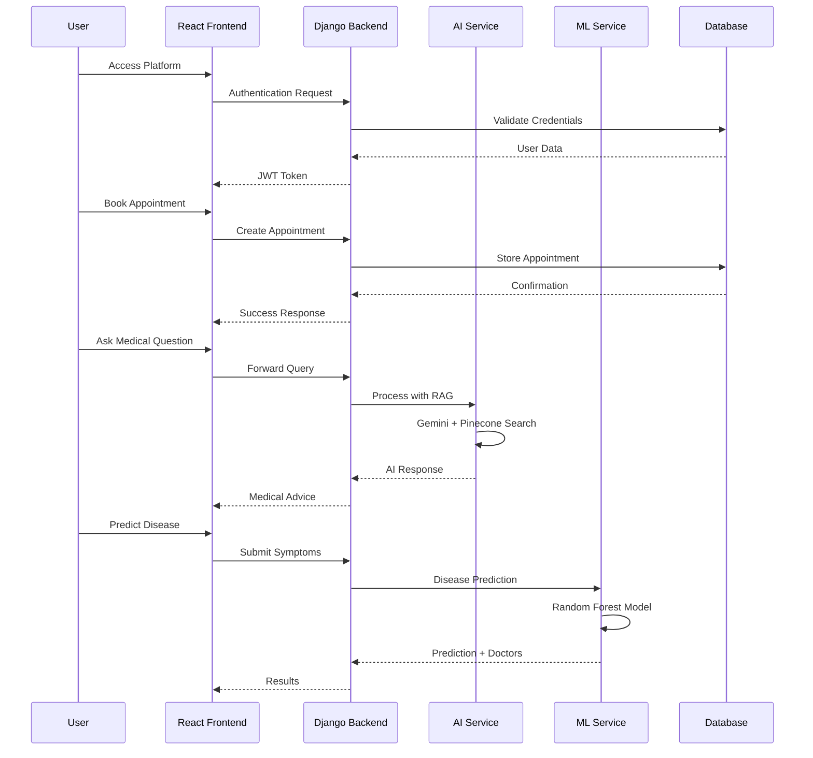

# 🏥 Smart Health Synchronizer (SHS)

**A comprehensive healthcare management platform that connects patients with verified doctors through intelligent appointment booking, AI-powered medical assistance, and ML-based disease prediction to achieve seamless, accessible, and informed healthcare delivery.**

---

## 📋 Overview

Smart Health Synchronizer (SHS) is a modern, microservices-based healthcare platform designed to bridge the gap between patients and healthcare providers through technology.

- **Problem Summary**: Patients struggle to find the right doctors, access medical advice quickly, and manage appointments efficiently. Traditional healthcare systems lack digital integration, making healthcare delivery fragmented and time-consuming.

- **What the System Does**: SHS provides an intelligent platform where patients can search for verified doctors, book appointments, get AI-powered medical advice, predict diseases based on symptoms, receive doctor recommendations, and maintain digital health records.

- **Who It's For**: 
  - **Patients**: Seeking convenient access to healthcare services and medical information
  - **Doctors**: Managing appointments, patient records, and sharing medical knowledge
  - **Healthcare Administrators**: Overseeing doctor verification and system management

- **Key Technologies**: Django REST Framework, React, FastAPI, Google Gemini AI, Machine Learning (scikit-learn), Pinecone Vector Database, SQLite3

---
## 📑 Table of Contents

- [Overview](#-overview)
- [Problem Statement](#-problem-statement)
- [Solution](#-solution)
- [Key Features](#-key-features)
- [System Architecture](#-system-architecture)
- [Tech Stack](#-tech-stack)
- [Services Documentation](#-services-documentation)
- [Installation](#-installation)
- [Run Locally](#-run-locally)
- [Future Improvements](#-future-improvements)
- [Contributing](#-contributing)
- [License](#-license)
- [Author](#-author)
- [Support](#-support)

---


## 🎯 Problem Statement

### Current Situation
Healthcare delivery faces significant challenges in the digital age:
- Patients cannot easily find doctors specialized in treating specific diseases
- Booking appointments requires phone calls and physical visits
- Access to medical advice is limited to clinic hours
- Health records are scattered across different providers
- Symptom-based doctor discovery is virtually non-existent

### Core Pain Point
**Lack of intelligent, integrated digital healthcare infrastructure** that connects patients with the right healthcare providers while providing instant medical guidance and maintaining comprehensive health records.

### Gap in Existing Solutions
- Traditional systems lack AI-powered symptom analysis
- No intelligent doctor recommendation based on health conditions
- Poor integration between appointment booking and medical assistance
- Limited or no digital health record management
- No real-time medical chatbot assistance

---

## 💡 Solution

Smart Health Synchronizer solves these problems by providing an **intelligent, AI-powered healthcare ecosystem** that combines appointment management, disease prediction, doctor recommendations, and medical assistance in a single, unified platform powered by machine learning and artificial intelligence.

### 🌟 Key Features

#### For Patients 🏥
- **🔍 Smart Doctor Discovery**: Search and filter doctors by specialization, location, rating, and disease expertise
- **📅 Easy Appointment Booking**: Book appointments with verified doctors with CAPTCHA security and instant confirmation
- **🤖 AI Medical Chatbot**: Get instant medical advice from an AI assistant powered by Google Gemini with RAG (Retrieval-Augmented Generation)
- **🧬 Disease Prediction**: Predict potential diseases from symptoms using ML models (90.5% accuracy with Random Forest)
- **👨‍⚕️ Intelligent Doctor Recommendation**: Get personalized doctor recommendations based on predicted diseases
- **📋 Health Record Management**: Access prescriptions, medical history, and appointment records in one place
- **⭐ Doctor Ratings & Reviews**: Rate and review doctors to help other patients make informed decisions

#### For Doctors 👨‍⚕️
- **📊 Comprehensive Dashboard**: View today's appointments, upcoming schedules, and all requests in one place
- **💊 Digital Prescription System**: Create and manage prescriptions with vital signs, diagnosis, and medications
- **📝 Medical Blog Publishing**: Share health knowledge, medical tips, and awareness content
- **🏆 Profile Management**: Showcase qualifications, specializations, experience, and disease treatment expertise
- **👥 Patient Management**: Access patient medical history and appointment records
- **📈 Rating System**: Receive ratings and feedback from patients

#### For Administrators 🔧
- **✅ Doctor Verification**: Manual verification system for doctor licenses and qualifications
- **👤 User Management**: Manage patient and doctor accounts
- **📢 Content Moderation**: Oversee medical blogs and community content
- **📊 System Monitoring**: Track platform usage and performance metrics

#### AI & ML Capabilities 🤖
- **RAG-Powered Chatbot**: Context-aware medical responses using Retrieval-Augmented Generation with Google Gemini and Pinecone vector database
- **Disease Prediction Models**: Three ML models (Random Forest 90.5%, Decision Tree 87.2%, Logistic Regression 85.8%)
- **132 Symptoms Recognition**: Comprehensive symptom database covering 41 diseases
- **Medical Knowledge Base**: Semantic search across medical documents with source citations
- **Doctor-Disease Mapping**: Intelligent matching of diseases to medical specializations

---

## 🏗️ System Architecture

### Architecture Diagram



### Architecture Overview

| Layer | Components | Responsibilities |
|-------|-----------|------------------|
| **Client** | React Frontend | User interface, authentication, appointment booking, AI chat |
| **Application** | Django Backend | API gateway, business logic, authentication, data management |
| **AI/ML** | AI Service, ML Service | Medical chatbot (RAG), disease prediction, doctor recommendations |
| **AI Components** | Gemini, Pinecone, ML Models | Language model, vector storage, prediction models |
| **Data** | PostgreSQL | Persistent storage for users, doctors, appointments, blogs |


### System Workflow

**📋 How the System Works:**

1. **User Authentication** → User accesses the frontend and authenticates via Django backend with JWT tokens
2. **Patient Portal** → Patients search for doctors, view profiles, and book appointments stored in SQLite3
3. **AI Medical Chatbot** → User asks medical questions → Backend forwards to AI Service → Gemini LLM processes with Pinecone RAG → Returns evidence-based answers
4. **Disease Prediction** → User inputs symptoms → Backend sends to ML Service → Random Forest model predicts disease (90.5% accuracy) → Returns diagnosis with recommended doctors
5. **Doctor Dashboard** → Doctors manage appointments, create prescriptions, publish blogs, and track patient history
6. **Admin Panel** → Admins verify doctors, manage users, moderate content, and monitor system health

**🔄 Data Flow:**
```
User Request → React Frontend → Django API (JWT) → SQLite3/AI/ML Services → Response Chain → UI Update
```

### Communication Flow



---

## 🛠️ Tech Stack

### Frontend
- **React** 19.2.0 - UI library for building user interfaces
- **Vite** 7.2.4 - Fast build tool and dev server
- **Tailwind CSS** 3.4 - Utility-first CSS framework
- **React Router DOM** 7.11 - Client-side routing
- **Axios** 1.13.2 - HTTP client for API requests
- **Lucide React** - Icon library

### Backend
- **Django** 4.2.7 - High-level Python web framework
- **Django REST Framework** 3.14.0 - RESTful API toolkit
- **djangorestframework-simplejwt** 5.3.1 - JWT authentication
- **django-cors-headers** 4.3.1 - CORS handling
- **django-filter** 23.5 - Advanced query filtering

### ML / AI Services
- **FastAPI** 0.108.0 / 0.116.2 - Modern Python API framework
- **Google Gemini** (via langchain-google-genai) - Large Language Model
- **LangChain** 0.1.0 - LLM orchestration framework
- **Pinecone** 3.0.0 - Vector database for semantic search
- **sentence-transformers** 3.4.0 - Text embeddings (384-dim)
- **scikit-learn** 1.7.2 - Machine learning library
- **pandas** 2.3.2 - Data manipulation
- **numpy** 2.2.6 - Numerical computing

### Database
- **PostgreSQL** 15+ - Relational database
- **psycopg2-binary** 2.9.9 - PostgreSQL adapter for Python

### Tools & Services
- **Git** - Version control
- **Uvicorn** 0.25.0 - ASGI server for FastAPI
- **python-dotenv** 1.0.0 - Environment variable management
- **drf-spectacular** 0.27.0 - OpenAPI schema generation
- **Requests** 2.31.0 - HTTP library for Python

---

## 🚀 Installation

### Prerequisites

Before running the project, ensure you have the following installed:

- **Python** 3.10 or higher
- **Node.js** 18+ and npm
- **Git** for version control

> **📚 Detailed Setup Instructions:**
> - **Backend Setup**: See [backend/README.md](./backend/README.md) for detailed Django setup, database configuration, and API documentation
> - **Frontend Setup**: See [frontend/README.md](./frontend/README.md) for React app setup, routing, and component structure
> - **AI Service Setup**: See [ai-service/README.md](./ai-service/README.md) for RAG implementation, Gemini API, and Pinecone configuration
> - **ML Service Setup**: See [disease-prediction-service/README.md](./disease-prediction-service/README.md) for ML model training, disease prediction API

### Required API Keys

- **Google Gemini API Key**: Get from [Google AI Studio](https://makersuite.google.com/app/apikey)
- **Pinecone API Key**: Get from [Pinecone Console](https://www.pinecone.io/)

---

## 💻 Run Locally

Follow these steps to run the project on your local machine:

### Step 1: Clone the Repository

```bash
git clone https://github.com/prantic-paul/SHS.git
cd SHS
```

### Step 2: Setup Django Backend

> 💡 **Note**: The project uses **SQLite3** database (`db.sqlite3`) by default for easy local development. No PostgreSQL setup needed!

```bash
cd backend

# Create virtual environment
python -m venv venv

# Activate virtual environment
source venv/bin/activate  # On Windows: venv\Scripts\activate

# Install dependencies
pip install -r requirements.txt

# Create .env file
cat > .env << EOF
DEBUG=True
SECRET_KEY=your-secret-key-here
AI_SERVICE_URL=http://localhost:8001
ML_SERVICE_URL=http://localhost:8002
EOF

# Run migrations (creates db.sqlite3 automatically)
python manage.py makemigrations
python manage.py migrate

# Create superuser for admin access
python manage.py createsuperuser

# Start Django server
python manage.py runserver
# Backend runs at http://localhost:8000
```

> 📖 **For detailed backend setup, database schema, and API endpoints**, see [backend/README.md](./backend/README.md)

### Step 3: Setup AI Service (Medical Chatbot)

```bash
# Open new terminal
cd ai-service

# Create virtual environment
python -m venv venv
source venv/bin/activate  # On Windows: venv\Scripts\activate

# Install dependencies
pip install -r requirements.txt

# Create .env file with API keys
cat > .env << EOF
GOOGLE_API_KEY=your_gemini_api_key_here
PINECONE_API_KEY=your_pinecone_api_key_here
PINECONE_ENVIRONMENT=your_pinecone_environment
PINECONE_INDEX_NAME=medical-knowledge
EOF

# Index medical documents (first time only)
python index_documents.py

# Start AI service
uvicorn main:app --reload --port 8001
# AI Service runs at http://localhost:8001
```

> 📖 **For RAG implementation details, Gemini setup, and Pinecone configuration**, see [ai-service/README.md](./ai-service/README.md)

### Step 4: Setup Disease Prediction Service

```bash
# Open new terminal
cd disease-prediction-service

# Create virtual environment
python -m venv venv
source venv/bin/activate  # On Windows: venv\Scripts\activate

# Install dependencies
pip install -r requirements.txt

# Train ML models (first time only - takes 2-3 minutes)
python train_model.py

# Start ML service
uvicorn main:app --reload --port 8002
# ML Service runs at http://localhost:8002
```

> 📖 **For ML model details, training process, and prediction API**, see [disease-prediction-service/README.md](./disease-prediction-service/README.md)

### Step 5: Setup React Frontend

```bash
# Open new terminal
cd frontend

# Install dependencies
npm install

# Create .env file
cat > .env << EOF
VITE_API_URL=http://localhost:8000
EOF

# Start development server
npm run dev
# Frontend runs at http://localhost:5173
```

> 📖 **For frontend architecture, component structure, and routing details**, see [frontend/README.md](./frontend/README.md)

### Step 6: Access the Application

Once all services are running:

| Service | URL | Purpose |
|---------|-----|---------|
| **Frontend** | http://localhost:5173 | Main application interface |
| **Backend API** | http://localhost:8000/api/v1/ | REST API endpoints |
| **Admin Panel** | http://localhost:8000/admin/ | Django admin dashboard |
| **AI Service Docs** | http://localhost:8001/docs | FastAPI auto-generated docs |
| **ML Service Docs** | http://localhost:8002/docs | FastAPI auto-generated docs |

### Step 7: First Steps

1. **Register a Patient Account**: Go to http://localhost:5173/register
2. **Register as Doctor**: Select "Doctor" role during registration
3. **Admin Approval**: Login to admin panel with superuser credentials and approve doctor application
4. **Test Features**:
   - Search and book appointments with doctors
   - Chat with AI medical assistant
   - Try disease prediction → view recommended doctors
   - Doctors can manage appointments and create prescriptions

### Quick Start (Alternative - All Services at Once)

If you want to start all services with one script:

```bash
# Make the script executable
chmod +x start-all.sh

# Run all services
./start-all.sh
```

To stop all services:

```bash
./stop-all.sh
```

---

## 🔮 Future Improvements

### Security Enhancements 🔐
- **Email Verification**: Implement email verification during registration to ensure valid user accounts
- **Two-Factor Authentication (2FA)**: Add optional 2FA for enhanced account security
- **Password Reset via Email**: Secure password recovery mechanism
- **Rate Limiting**: Prevent API abuse with request rate limiting
- **OAuth Integration**: Social login with Google, Facebook, GitHub

### Payment Integration 💳
- **Online Payment Gateway**: Integrate payment systems (Stripe, PayPal, bKash) for appointment fees
- **Subscription Plans**: Premium features for patients (priority booking, extended chat)
- **Doctor Consultation Fees**: Monetization model for video consultations
- **Payment History**: Track and manage transaction records

### Advanced Features 🚀
- **Video Consultation**: Real-time video calls between doctors and patients using WebRTC
- **Real-time Notifications**: Push notifications for appointment reminders and updates
- **Email/SMS Notifications**: Automated reminders for appointments and medication
- **Mobile Application**: Native iOS and Android apps using React Native
- **Telemedicine Integration**: Complete telehealth functionality
- **Lab Test Integration**: Connect with diagnostic labs for test bookings
- **Pharmacy Integration**: Direct prescription fulfillment from partner pharmacies

### AI/ML Enhancements 🤖
- **Medical Image Analysis**: AI-powered diagnosis from X-rays, CT scans, MRIs
- **Personalized Health Insights**: ML-based health trend analysis and predictions
- **Drug Interaction Checker**: Warn about dangerous medication combinations
- **Voice-based Symptom Input**: Natural language processing for hands-free interaction
- **Multi-language Support**: Chatbot support for Bengali, Hindi, and other languages

### Platform Improvements 📊
- **Analytics Dashboard**: Comprehensive insights for doctors and admins
- **Patient Health Timeline**: Visual representation of health journey
- **Appointment History Export**: Download records in PDF format
- **Doctor Availability Calendar**: Advanced scheduling with recurring slots
- **Review Moderation System**: AI-powered fake review detection
- **Performance Optimization**: Caching, CDN integration, database optimization

---

---

## 🤝 Contributing

We welcome contributions from the community! Whether you're fixing bugs, adding features, improving documentation, or spreading the word, your help is appreciated.

### How to Contribute

1. **Fork the Repository**
   ```bash
   git clone https://github.com/prantic-paul/SHS.git
   cd SHS
   ```

2. **Create a Branch**
   ```bash
   git checkout -b feature/your-feature-name
   ```

3. **Make Your Changes**
   - Write clean, documented code
   - Follow existing code style
   - Add tests if applicable

4. **Commit Your Changes**
   ```bash
   git add .
   git commit -m "feat: add your feature description"
   ```

5. **Push to Your Fork**
   ```bash
   git push origin feature/your-feature-name
   ```

6. **Create a Pull Request**
   - Go to the original repository
   - Click "New Pull Request"
   - Describe your changes

### Contribution Guidelines

- **Code Quality**: Write clean, maintainable code with proper comments
- **Testing**: Test your changes thoroughly before submitting
- **Documentation**: Update documentation for any new features
- **Commit Messages**: Use conventional commit format (feat:, fix:, docs:, etc.)
- **Issue First**: For major changes, open an issue first to discuss

### Areas for Contribution

- 🐛 **Bug Fixes**: Help identify and fix bugs
- ✨ **New Features**: Implement new healthcare features
- 📝 **Documentation**: Improve docs, add tutorials, fix typos
- 🧪 **Testing**: Add unit tests, integration tests
- 🎨 **UI/UX**: Enhance user interface and experience
- 🌍 **Translations**: Add multi-language support
- ⚡ **Performance**: Optimize code and database queries

### Code of Conduct

- Be respectful and inclusive
- Provide constructive feedback
- Help others learn and grow
- Focus on what's best for the community

For detailed guidelines, see [CONTRIBUTING.md](./CONTRIBUTING.md)

---

## 📄 License

This project is licensed under the **MIT License** - see the [LICENSE](LICENSE) file for details.

### MIT License Summary

```
MIT License

Copyright (c) 2026 Prantic Paul

Permission is hereby granted, free of charge, to any person obtaining a copy
of this software and associated documentation files (the "Software"), to deal
in the Software without restriction, including without limitation the rights
to use, copy, modify, merge, publish, distribute, sublicense, and/or sell
copies of the Software, and to permit persons to whom the Software is
furnished to do so, subject to the following conditions:

The above copyright notice and this permission notice shall be included in all
copies or substantial portions of the Software.

THE SOFTWARE IS PROVIDED "AS IS", WITHOUT WARRANTY OF ANY KIND, EXPRESS OR
IMPLIED, INCLUDING BUT NOT LIMITED TO THE WARRANTIES OF MERCHANTABILITY,
FITNESS FOR A PARTICULAR PURPOSE AND NONINFRINGEMENT. IN NO EVENT SHALL THE
AUTHORS OR COPYRIGHT HOLDERS BE LIABLE FOR ANY CLAIM, DAMAGES OR OTHER
LIABILITY, WHETHER IN AN ACTION OF CONTRACT, TORT OR OTHERWISE, ARISING FROM,
OUT OF OR IN CONNECTION WITH THE SOFTWARE OR THE USE OR OTHER DEALINGS IN THE
SOFTWARE.
```

**What this means:**
- ✅ Free to use for personal and commercial projects
- ✅ Modify and distribute as needed
- ✅ Private use allowed
- ⚠️ No warranty provided
- ⚠️ Must include original license and copyright notice

---

## 👨‍💻 Author

**Prantic Paul**

<table>
<tr>
<td width="30%">

</td>
<td width="70%">
<b>Full Stack Developer | AI/ML Enthusiast</b><br/><br/>
Passionate about building intelligent healthcare solutions that make a difference.<br/><br/>

📧 <b>Email:</b> pranticpaulshimul@gmail.com<br/>
📱 <b>Phone:</b> +880 1739509014<br/>
💼 <b>LinkedIn:</b> <a href="https://www.linkedin.com/in/prantic-paul-80917a28a/">Prantic Paul</a><br/>
🐙 <b>GitHub:</b> <a href="https://github.com/prantic-paul">@prantic-paul</a><br/>
</td>
</tr>
</table>

---


## 🙏 Acknowledgments

- Google Gemini for providing the powerful LLM API
- Pinecone for vector database services
- The Django and React communities for excellent frameworks
- All contributors and testers who helped improve this project

---

## 📞 Support

For questions, issues, or contributions:

- 📧 **Email**: pranticpaulshimul@gmail.com
- 🐛 **Issues**: [GitHub Issues](https://github.com/prantic-paul/SHS/issues)
- 💬 **Discussions**: [GitHub Discussions](https://github.com/prantic-paul/SHS/discussions)

---

<div align="center">

**⭐ If you find this project helpful, please consider giving it a star on GitHub! ⭐**

Made with ❤️ by [Prantic Paul](https://github.com/prantic-paul)

</div>
