# 🤖 AI Service – Smart Health Synchronizer

**RAG-based Medical Chatbot powered by Google Gemini, Pinecone Vector Database, and LangChain for intelligent, context-aware healthcare assistance.**

---

## 📋 Overview

The AI Service is an advanced **Retrieval-Augmented Generation (RAG)** chatbot designed to provide accurate, context-aware medical information to SHS platform users. By combining the power of:

- **Google Gemini 1.5 Flash** - Latest LLM for natural language understanding
- **Pinecone Vector Database** - Fast semantic search over medical knowledge
- **LangChain** - Orchestration framework for RAG pipeline
- **HuggingFace Embeddings** - Convert text to vector representations (sentence-transformers)

The AI Service offers **intelligent medical advice** that is grounded in authoritative medical documents, reducing hallucinations and improving factual accuracy.

**Key Capabilities:**
- 💬 Natural conversational interface for health queries
- 📚 Context-aware responses from medical knowledge base
- �� Semantic search across medical documents
- 🎯 Specialized medical prompting strategies
- ⚡ Fast response times with vector similarity search
- 🛡️ Safety disclaimers and medical ethics compliance

**Important Note:** This AI assistant provides general health information only. It is **NOT** a substitute for professional medical diagnosis or treatment. Users are always advised to consult qualified healthcare providers.

---

## 🎯 Problem It Solves

### Healthcare Information Gap

**Problems:**
1. **Information Overload** - Patients struggle to find reliable health information online
2. **Medical Jargon** - Complex medical terminology confuses non-experts
3. **Misinformation** - Unverified health advice spreads easily
4. **Accessibility** - Limited access to immediate medical consultation
5. **Question Complexity** - Users don't know what to ask or how to describe symptoms

### Our Solution

The AI Service bridges this gap by:

✅ **Accurate Information** - Responses grounded in medical documents, not just LLM training data  
✅ **Plain Language** - Translates complex medical concepts into understandable terms  
✅ **24/7 Availability** - Instant responses anytime, anywhere  
✅ **Personalized Guidance** - Context-aware answers based on user queries  
✅ **Doctor Recommendations** - Suggests appropriate specialist types for conditions  
✅ **Safe Advice** - Always includes disclaimers and encourages professional consultation

**Use Cases:**
- Explaining medical test results
- Understanding medication side effects
- Identifying when to seek urgent care
- Preparing questions before doctor appointments
- Learning about medical conditions and treatments
- Finding appropriate specialist recommendations

---

## 🧠 AI Approach

### Retrieval-Augmented Generation (RAG)

Traditional chatbots rely solely on LLM knowledge, which can be:
- ❌ **Outdated** - Training data is static
- ❌ **Unreliable** - Prone to hallucinations
- ❌ **Generic** - Lacks domain-specific expertise

**RAG Solves This:**

```
User Query → Embedding → Vector Search → Relevant Docs → Gemini (with context) → Answer
```

### How It Works

1. **Document Ingestion**
   - Medical documents (PDF) are loaded
   - Documents split into chunks (500 chars, 50 overlap)
   - Each chunk converted to embeddings (vectors)
   - Embeddings stored in Pinecone with metadata

2. **Query Processing**
   - User query converted to embedding
   - Similarity search in Pinecone finds relevant chunks
   - Top K most relevant documents retrieved

3. **Context Injection**
   - Retrieved documents added to system prompt
   - User query appended
   - Full context sent to Gemini

4. **Answer Generation**
   - Gemini generates response grounded in provided context
   - Response formatted with clear structure
   - Safety disclaimers added automatically

### Why RAG for Healthcare?

- 📖 **Up-to-date Information** - Knowledge base can be updated anytime
- 🎯 **Domain Expertise** - Uses curated medical documents
- 🔬 **Verifiable** - Responses can be traced to source documents
- 🛡️ **Reduced Hallucinations** - LLM constrained by retrieved context
- ⚡ **Efficient** - Only relevant information sent to LLM, reducing tokens

---

## 🏗️ Architecture Flow

```mermaid
graph TB
    subgraph "Client Layer"
        User[👤 User<br/>React Frontend]
    end
    
    subgraph "Backend Layer"
        Django[🔧 Django Backend<br/>Port 8000]
    end
    
    subgraph "AI Service - Port 8001"
        FastAPI[⚡ FastAPI Server]
        
        subgraph "RAG Pipeline"
            Embedding[🔤 HuggingFace Embeddings<br/>sentence-transformers/<br/>all-MiniLM-L6-v2<br/>384 dimensions]
            
            VectorDB[(🗄️ Pinecone Vector DB<br/>Medical Knowledge Base<br/>Indexed Documents)]
            
            Retriever[🔍 Retriever<br/>Top-K Similarity Search<br/>Returns relevant chunks]
            
            LangChain[🔗 LangChain<br/>Retrieval Chain<br/>Context Assembly]
            
            Gemini[🤖 Google Gemini 1.5 Flash<br/>Response Generation<br/>Temperature: 0.3]
        end
    end
    
    subgraph "External Services"
        PineconeCloud[☁️ Pinecone Cloud<br/>Vector Database Service]
        GoogleAI[☁️ Google AI<br/>Gemini API]
    end
    
    subgraph "Data Source"
        MedicalDocs[📚 Medical Documents<br/>PDF files from Drive<br/>Chunked & Embedded]
    end
    
    User -->|Chat Message| Django
    Django -->|POST /chat| FastAPI
    
    FastAPI --> Embedding
    Embedding -->|Query Vector| Retriever
    
    Retriever <-->|Similarity Search| VectorDB
    VectorDB <-->|Synced| PineconeCloud
    
    Retriever -->|Relevant Docs| LangChain
    LangChain -->|Prompt + Context| Gemini
    Gemini <-->|API Calls| GoogleAI
    
    Gemini -->|Response| FastAPI
    FastAPI -->|JSON Response| Django
    Django -->|Display| User
    
    MedicalDocs -.->|One-time Indexing| VectorDB
    
    style User fill:#61dafb
    style Django fill:#092e20
    style FastAPI fill:#009688
    style Gemini fill:#4285f4
    style VectorDB fill:#8b5cf6
    style MedicalDocs fill:#f59e0b
```



### Request Flow (Step-by-Step)

1. **User Query** → Patient asks "What are symptoms of diabetes?"
2. **Backend Proxy** → Django forwards request to AI Service (Port 8001)
3. **FastAPI Receives** → Validates request, extracts message
4. **Embedding Generation** → HuggingFace model converts query to 384-dim vector
5. **Vector Search** → Pinecone finds top 5 most similar document chunks
6. **Context Assembly** → LangChain combines system prompt + retrieved docs + query
7. **LLM Generation** → Gemini 1.5 Flash generates context-aware response
8. **Response Formatting** → Add disclaimers, format nicely
9. **Return to Client** → JSON response sent back through Django to frontend

---

## 🛠️ Tech Stack

| Component | Technology | Version | Purpose |
|-----------|-----------|---------|---------|
| **Framework** | FastAPI | 0.108.0 | Async web framework |
| **LLM** | Google Gemini | 1.5 Flash | Response generation |
| **Vector DB** | Pinecone | 3.0.0 | Semantic search & storage |
| **Orchestration** | LangChain | 0.1.0 | RAG pipeline orchestration |
| **LangChain Community** | langchain-community | 0.0.13 | Community integrations |
| **LangChain Gemini** | langchain-google-genai | 0.0.6 | Gemini integration |
| **LangChain Pinecone** | langchain-pinecone | 0.0.3 | Pinecone integration |
| **Embeddings** | sentence-transformers | 3.4.0 | Text vectorization |
| **Embedding Model** | all-MiniLM-L6-v2 | Latest | 384-dim embeddings |
| **PDF Processing** | pypdf | 3.17.4 | Extract text from PDFs |
| **HTTP Client** | requests | 2.31.0 | API calls |
| **Environment** | python-dotenv | 1.0.0 | Config management |
| **Validation** | Pydantic | 2.5.3 | Data validation |
| **Settings** | pydantic-settings | 2.1.0 | Settings management |

---

## 📚 Data Sources

### Medical Knowledge Base

The AI Service is grounded in a comprehensive medical textbook that covers:

**📖 Medical Textbook (Primary Source):**
- General medicine and diagnostics
- Disease descriptions and symptoms
- Treatment protocols and guidelines
- Medication information
- Preventive healthcare
- Medical terminology and definitions

**Download Medical Book:**  
🔗 **Google Drive Link:** https://drive.google.com/file/d/1JFDzKO4beZjuFRQyvggW93V_givIJYqS/view?usp=sharing

**Book Details:**
- Format: PDF
- Content: Comprehensive medical knowledge
- Usage: Chunked into smaller segments and indexed in Pinecone
- Purpose: Provides factual medical context for RAG system

### Document Processing Pipeline

```python
# 1. Document Loading
from langchain_community.document_loaders import PyPDFLoader

loader = PyPDFLoader("medical_book.pdf")
documents = loader.load()

# 2. Text Splitting (chunks of 500 chars, 50 overlap)
from langchain.text_splitter import RecursiveCharacterTextSplitter

text_splitter = RecursiveCharacterTextSplitter(
    chunk_size=500,
    chunk_overlap=50,
    separators=["\n\n", "\n", ". ", " ", ""]
)
chunks = text_splitter.split_documents(documents)

# 3. Embedding Generation
from langchain_community.embeddings import HuggingFaceEmbeddings

embeddings = HuggingFaceEmbeddings(
    model_name="sentence-transformers/all-MiniLM-L6-v2",
    model_kwargs={'device': 'cpu'}
)

# 4. Vector Store Creation & Indexing
from langchain_pinecone import PineconeVectorStore

vectorstore = PineconeVectorStore.from_documents(
    chunks, 
    embeddings, 
    index_name="shs-medical"
)
```

### Indexing Process

To index the medical documents into Pinecone:

```bash
# 1. Download the medical book from Drive link
# 2. Place it in the ai-service directory
# 3. Run indexing script
python index_documents.py
```

This script:
- Loads PDF document
- Splits into chunks
- Generates embeddings
- Uploads to Pinecone cloud

---

## 🎯 Prompting Strategy

### System Prompt Design

The AI Service uses carefully crafted prompts to ensure medical accuracy and safety:

```python
SYSTEM_PROMPT = """
You are a knowledgeable and empathetic medical AI assistant for the Smart Health Synchronizer platform.

Your role is to:
1. Provide accurate medical information based on the provided medical documents
2. Explain complex medical concepts in simple, understandable language
3. Suggest appropriate specialists when needed
4. Always prioritize patient safety

Guidelines:
- Base responses ONLY on the provided medical context
- Use clear, compassionate language
- Avoid medical jargon; explain terms when necessary
- Provide actionable advice (e.g., "consult a cardiologist")
- NEVER provide definitive diagnoses

CRITICAL SAFETY RULES:
- You are NOT a doctor and cannot diagnose conditions
- Always include disclaimer about consulting healthcare professionals
- For emergencies, direct users to call emergency services
- Your advice is for informational purposes only

Response Format:
- Clear explanation of the medical topic
- Key points in bullet format
- Recommended specialist type (if applicable)
- Safety disclaimer at the end

Context from medical documents:
{context}

User Question: {question}

Provide a helpful, accurate, and safe response:
"""
```

### Response Structure

AI responses follow this consistent structure:

```
📋 **Medical Information**
[Clear explanation based on retrieved medical documents]

🔍 **Key Points**
- Important point 1
- Important point 2
- Important point 3

👨‍⚕️ **Recommended Action**
[Suggested specialist type or next steps]

⚠️ **Important Medical Disclaimer**
This information is for educational purposes only and should not be used for self-diagnosis. Please consult with a qualified healthcare provider for proper medical diagnosis and treatment. In case of emergency, call your local emergency services immediately.
```

### Temperature & Model Settings

```python
# Google Gemini Configuration
llm = ChatGoogleGenerativeAI(
    model="gemini-1.5-flash",
    temperature=0.3,  # Low temperature for factual responses
    max_tokens=1024,  # Reasonable response length
    top_p=0.95
)
```

**Why temperature=0.3?**
- Low temperature = more deterministic, factual responses
- Reduces creative hallucinations
- Better for medical domain where accuracy is critical

---

## 🌐 API Endpoints

### Base URL
`http://localhost:8001`

### Endpoints

#### 1. **POST /chat** - Send Chat Message

Send a message to the AI medical assistant.

**Request:**
```bash
curl -X POST http://localhost:8001/chat \
  -H "Content-Type: application/json" \
  -d '{
    "message": "What are the symptoms of diabetes?",
    "user_id": "user_123"
  }'
```

**Request Body:**
```json
{
  "message": "What are the symptoms of diabetes?",
  "user_id": "user_123"
}
```

**Response:**
```json
{
  "response": "📋 **Diabetes Symptoms**\n\nDiabetes is a metabolic disorder characterized by elevated blood sugar levels...\n\n🔍 **Key Symptoms**\n- Increased thirst and frequent urination\n- Extreme hunger\n- Unexplained weight loss\n- Fatigue and weakness\n- Blurred vision\n- Slow-healing wounds\n\n👨‍⚕️ **Recommended Action**\nConsult an **Endocrinologist** for proper diagnosis...\n\n⚠️ **Disclaimer**\nThis is educational information only. Consult a healthcare provider.",
  "timestamp": "2026-01-22T10:30:00Z"
}
```

**Status Codes:**
- `200 OK` - Successful response
- `400 Bad Request` - Invalid input
- `500 Internal Server Error` - Service error

#### 2. **GET /health** - Health Check

Check AI service status and connectivity.

**Request:**
```bash
curl http://localhost:8001/health
```

**Response:**
```json
{
  "status": "healthy",
  "service": "ai-service",
  "version": "1.0.0",
  "timestamp": "2026-01-22T10:30:00Z",
  "pinecone_connected": true,
  "gemini_available": true,
  "embeddings_loaded": true
}
```

---

## ⚠️ Limitations

### Current Constraints

1. **Not a Medical Diagnosis Tool**
   - Cannot replace professional medical consultation
   - Should not be used for emergency situations
   - Cannot interpret lab results, X-rays, or medical images
   - No personalized medical advice

2. **Knowledge Base Scope**
   - Limited to documents in vector database
   - May not cover very rare conditions
   - Medical knowledge requires periodic updates
   - General medicine focus (not specialist-level detail)

3. **Language Support**
   - Primary: English
   - Other languages: Limited (Gemini supports, but knowledge base is English)

4. **Privacy Considerations**
   - Chat history stored in Django backend database
   - User queries sent to external services (Google Gemini, Pinecone Cloud)
   - No Protected Health Information (PHI) should be shared
   - HIPAA compliance not implemented

5. **Technical Limitations**
   - Requires internet connection for Gemini and Pinecone
   - Average response time: 2-5 seconds
   - Rate limits on free tiers of external services
   - Vector database requires periodic reindexing

6. **Response Quality**
   - May occasionally provide incomplete information
   - Context window limits very long conversations
   - Cannot access real-time medical research
   - Retrieval quality depends on document indexing

### Safety Measures

✅ **Always includes medical disclaimer**  
✅ **Encourages professional consultation**  
✅ **Suggests appropriate specialists**  
✅ **Refuses to provide diagnoses**  
✅ **Provides emergency guidance when needed**  
✅ **Low temperature for factual responses**

---

## 🚀 Future Enhancements

### Planned Improvements

1. **Enhanced Knowledge Base**
   - Expand to multiple medical textbooks and journals
   - Add specialist-specific knowledge domains
   - Include latest medical research papers
   - Multi-language medical documents

2. **Advanced RAG Techniques**
   - Hybrid search (vector + keyword)
   - Re-ranking retrieved documents
   - Query expansion and reformulation
   - Multi-hop reasoning

3. **Model Improvements**
   - Custom fine-tuned Gemini model on medical data
   - Domain-specific embeddings for better retrieval
   - Medical entity recognition (NER)
   - Confidence scoring for answers

4. **Personalization**
   - User medical history integration (with consent)
   - Personalized health recommendations
   - Follow-up conversation context
   - Learning from feedback

5. **Advanced Features**
   - Image analysis (X-rays, skin conditions) with Gemini Pro Vision
   - Voice input/output for accessibility
   - Multi-turn conversation memory
   - Source citation in responses

6. **Quality & Safety**
   - Medical professional review system
   - Fact-checking layer
   - Hallucination detection
   - A/B testing different prompts

---

## ⚙️ Environment Variables

Create `.env` file in `ai-service/` directory:

```env
# Google Gemini API
GOOGLE_API_KEY=your-gemini-api-key-here

# Pinecone Configuration
PINECONE_API_KEY=your-pinecone-api-key-here
PINECONE_ENVIRONMENT=us-east1-gcp
PINECONE_INDEX_NAME=shs-medical

# Model Configuration
EMBEDDING_MODEL=sentence-transformers/all-MiniLM-L6-v2
LLM_MODEL=gemini-1.5-flash
LLM_TEMPERATURE=0.3
MAX_TOKENS=1024

# Application Settings
SERVICE_HOST=0.0.0.0
SERVICE_PORT=8001
DEBUG=True
LOG_LEVEL=INFO

# Document Processing
CHUNK_SIZE=500
CHUNK_OVERLAP=50
TOP_K_RESULTS=5
```

---

## 🚀 Setup & Run

### Prerequisites
- Python 3.10+
- Google Gemini API key ([Get it here](https://makersuite.google.com/app/apikey))
- Pinecone account and API key ([Sign up here](https://www.pinecone.io/))

### Installation

```bash
# Navigate to AI service directory
cd ai-service

# Create virtual environment
python -m venv venv
source venv/bin/activate  # Windows: venv\Scripts\activate

# Install dependencies
pip install -r requirements.txt

# Configure environment
cp .env.example .env
nano .env  # Add your API keys
```

### Initialize Vector Database

**Step 1: Download Medical Book**
- Download from: https://drive.google.com/file/d/1JFDzKO4beZjuFRQyvggW93V_givIJYqS/view?usp=sharing
- Place in `ai-service/` directory (same level as main.py)

**Step 2: Run Indexing Script**
```bash
# Index medical documents into Pinecone (one-time setup)
python index_documents.py
```

This will:
- Load the medical book PDF
- Split into 500-character chunks
- Generate embeddings
- Upload to Pinecone cloud
- Takes ~5-10 minutes

### Run Service

```bash
# Start FastAPI server
uvicorn main:app --reload --port 8001
```

Service runs at `http://localhost:8001`

### Verify Setup

```bash
# Check health
curl http://localhost:8001/health

# Test chat
curl -X POST http://localhost:8001/chat \
  -H "Content-Type: application/json" \
  -d '{"message": "What is hypertension?", "user_id": "test"}'
```

### API Documentation

FastAPI auto-generates interactive docs:
- **Swagger UI:** http://localhost:8001/docs
- **ReDoc:** http://localhost:8001/redoc

---

## 📄 License

Part of Smart Health Synchronizer - MIT License

---

## 👨‍💻 Author

**Prantic Paul**  
- 📧 Email: pranticpaulshimul@gmail.com
- 🐙 GitHub: [@prantic-paul](https://github.com/prantic-paul)
