# 🧬 Disease Prediction Service – Smart Health Synchronizer

**Machine Learning-powered disease prediction system using Random Forest classifier to predict diseases from symptoms.**

---

## 📋 Overview

The Disease Prediction Service is a FastAPI-based microservice that uses **machine learning** to predict potential diseases based on user-reported symptoms. The service employs a **Random Forest classifier** trained on a comprehensive medical dataset to provide:

- **Multi-class classification** - Predicts among multiple diseases
- **Symptom-based prediction** - Users input symptoms, model predicts likely diseases
- **High accuracy** - Trained and evaluated on medical dataset
- **Fast inference** - Sub-second prediction time
- **Probability scores** - Provides confidence levels for predictions

**Key Capabilities:**
- 🏥 Predict diseases from symptom combinations
- 📊 Probability scores for top disease predictions
- 🎯 Comprehensive symptom coverage
- ⚡ Real-time predictions via REST API
- 🔬 Trained on augmented medical dataset
- 📈 Continuous model improvement

**Important Medical Disclaimer:** This tool is for **informational purposes only** and is NOT a substitute for professional medical diagnosis. Users experiencing health concerns should consult qualified healthcare providers immediately.

---

## 🎯 ML Problem Definition

### Problem Statement

**Task:** Multi-class classification problem  
**Input:** List of symptoms (text)  
**Output:** Disease prediction with probability scores

### Business Objective

Enable patients to:
1. Get preliminary disease insights based on symptoms
2. Understand which specialist to consult
3. Prepare informed questions for doctor appointments
4. Identify conditions that may require medical attention
5. Get alternative disease possibilities (differential diagnosis)

### Machine Learning Formulation

```
Given: Symptom List S = [symptom₁, symptom₂, ..., symptomₙ]
Process: Match symptoms to indexed symptom vocabulary
Predict: Disease D with probability P(D|S)
Output: Top disease predictions with confidence scores
```

**Classification Type:** Multi-class classification  
**Algorithm:** Random Forest Classifier  
**Features:** Symptom presence/absence (text to binary encoding)  
**Target:** Disease categories

### Evaluation Metrics

- **Accuracy:** Overall correct predictions
- **Precision:** True positives / (True positives + False positives)
- **Recall:** True positives / (True positives + False negatives)
- **F1-Score:** Harmonic mean of precision and recall

---

## 📊 Dataset Description

### Source

**📥 Dataset Download Link:**  
🔗 **Google Drive:** https://drive.google.com/file/d/1nxrNAHhYv0oNhET68nLjTeelHVx57Yag/view?usp=sharing

**Dataset Name:** `Final_Augmented_dataset_Diseases_and_Symptoms.csv`

### Dataset Overview

This is an augmented medical dataset that combines:
- Clinical symptom-disease associations
- Medical knowledge bases
- Synthetic augmented samples for better model generalization

**Dataset Format:**
- CSV file with diseases and associated symptoms
- First column: Disease name
- Remaining columns: Symptom features
- Binary encoding (1 = symptom present, 0 = symptom absent)

### Dataset Processing

The dataset is loaded and processed as follows:

```python
# Load dataset
data = pd.read_csv('Final_Augmented_dataset_Diseases_and_Symptoms.csv')

# Structure:
# Column 0: 'diseases' - Target variable
# Columns 1+: Symptom names - Feature variables

# Each row represents one disease-symptom combination
# Symptoms are binary encoded (0 or 1)
```

---

## 🔧 Data Preprocessing

### 1. Data Loading & Exploration

```python
import pandas as pd

# Load dataset
df = pd.read_csv('app/data/processed/Final_Augmented_dataset_Diseases_and_Symptoms.csv')

# Dataset structure
# Column 0: diseases (target)
# Columns 1+: symptoms (features)

print(f"Dataset shape: {df.shape}")
print(f"Number of diseases: {df['diseases'].nunique()}")
print(f"Number of symptoms: {len(df.columns) - 1}")
```

### 2. Label Encoding

```python
from sklearn.preprocessing import LabelEncoder

# Encode disease names to integers
encoder = LabelEncoder()
df['diseases'] = encoder.fit_transform(df['diseases'])

# Save encoder for later use
# encoder.classes_ contains original disease names
```

### 3. Feature Engineering

```python
# Extract features (symptoms) and target (disease)
X = df.iloc[:, 1:]  # All columns except first (symptoms)
y = df.iloc[:, 0]   # First column (diseases)

# Create symptom index for prediction
symptom_index = {symptom: idx for idx, symptom in enumerate(X.columns)}
```

### 4. Train-Test Split

```python
from sklearn.model_selection import train_test_split

X_train, X_test, y_train, y_test = train_test_split(
    X, y, 
    test_size=0.2,      # 20% for testing
    random_state=42,    # Reproducibility
    stratify=y          # Maintain class distribution
)
```

---

## 🤖 Model Selection

### Algorithm: Random Forest Classifier

**Why Random Forest?**

✅ **Ensemble Method** - Combines multiple decision trees for better accuracy  
✅ **Handles Binary Features** - Perfect for symptom presence/absence  
✅ **Resistant to Overfitting** - Averaging reduces variance  
✅ **Feature Importance** - Can identify which symptoms are most predictive  
✅ **No Feature Scaling Needed** - Works with binary features directly  
✅ **Fast Prediction** - Efficient for real-time inference  

### Model Configuration

```python
from sklearn.ensemble import RandomForestClassifier

model = RandomForestClassifier(
    n_estimators=100,     # 100 decision trees
    random_state=42,      # Reproducibility
    n_jobs=-1,            # Use all CPU cores
    verbose=1             # Show training progress
)
```

**Parameters Explained:**
- `n_estimators=100`: Train 100 decision trees and average their predictions
- `random_state=42`: Ensures reproducible results
- `n_jobs=-1`: Parallel processing using all CPU cores
- No max_depth: Trees grow until pure or minimum samples reached

---

## 📈 Training & Evaluation

### Model Training

```python
# Train the model
model.fit(X_train, y_train)

# Training logs show progress:
# [Parallel(n_jobs=-1)]: Done 100 out of 100 | elapsed: 2.3s finished
```

### Performance Metrics

After training, the model is evaluated on both training and test sets:

```python
from sklearn.metrics import accuracy_score, precision_score, recall_score, f1_score

# Predictions
train_pred = model.predict(X_train)
test_pred = model.predict(X_test)

# Calculate metrics
metrics = {
    'train_accuracy': accuracy_score(y_train, train_pred),
    'test_accuracy': accuracy_score(y_test, test_pred),
    'precision': precision_score(y_test, test_pred, average='weighted'),
    'recall': recall_score(y_test, test_pred, average='weighted'),
    'f1_score': f1_score(y_test, test_pred, average='weighted')
}
```

**Note:** Actual performance metrics depend on the dataset. Train the model using `python train_model.py` to see actual results.

### Model Artifacts

After training, the following files are saved:

```
app/data/models/
├── disease_model.pkl      # Trained Random Forest model
├── encoder.pkl            # Label encoder (disease names)
└── symptom_index.pkl      # Symptom to index mapping
```

---

## 🏗️ Architecture Flow

```mermaid
graph TB
    subgraph "Client Layer"
        User[👤 User<br/>Frontend]
    end
    
    subgraph "Backend Layer"
        Django[🔧 Django Backend<br/>Port 8000]
    end
    
    subgraph "ML Service - Port 8002"
        FastAPI[⚡ FastAPI Server]
        
        subgraph "Prediction Pipeline"
            Input[📝 Input Processing<br/>Symptom List]
            
            Matching[🔍 Symptom Matching<br/>Map to symptom index]
            
            Vector[🔢 Feature Vector<br/>Create binary array<br/>n_symptoms dimensions]
            
            Model[🤖 Random Forest Model<br/>100 decision trees<br/>Trained classifier]
            
            Decoder[📋 Result Decoding<br/>Label encoder<br/>Integer → Disease name]
            
            Ranking[📊 Confidence Ranking<br/>Top-K predictions<br/>with probabilities]
        end
        
        subgraph "Model Artifacts"
            ModelFile[(💾 disease_model.pkl<br/>Trained Random Forest)]
            EncoderFile[(💾 encoder.pkl<br/>Disease Label Encoder)]
            SymptomFile[(💾 symptom_index.pkl<br/>Symptom Dictionary)]
        end
    end
    
    subgraph "Training Phase"
        Dataset[📊 Dataset CSV<br/>50,000+ samples<br/>Diseases & Symptoms]
        Training[🏋️ Training Script<br/>train_model.py<br/>80-20 split]
    end
    
    User -->|Symptom List| Django
    Django -->|POST /predict| FastAPI
    
    FastAPI --> Input
    Input --> Matching
    Matching --> Vector
    Vector --> Model
    
    Model --> Decoder
    Decoder --> Ranking
    
    Model -.->|Loads| ModelFile
    Decoder -.->|Loads| EncoderFile
    Matching -.->|Loads| SymptomFile
    
    Ranking -->|JSON Response| FastAPI
    FastAPI -->|Prediction Result| Django
    Django -->|Display| User
    
    Dataset --> Training
    Training -.->|Saves models| ModelFile
    Training -.->|Saves encoder| EncoderFile
    Training -.->|Saves index| SymptomFile
    
    style User fill:#61dafb
    style Django fill:#092e20
    style FastAPI fill:#009688
    style Model fill:#ff6f00
    style Dataset fill:#f59e0b
    style ModelFile fill:#8b5cf6
```



### Prediction Flow (Step-by-Step)

1. **User Input** → Patient enters symptoms: ["fever", "cough", "headache"]
2. **Backend Proxy** → Django forwards to ML Service (Port 8002)
3. **FastAPI Receives** → Validates symptom list
4. **Symptom Matching** → Maps text symptoms to indices using symptom_index.pkl
5. **Feature Vector Creation** → Creates binary array (all 0s, then set matched symptoms to 1)
6. **Model Prediction** → Random Forest predicts disease probabilities
7. **Probability Extraction** → Get probability scores for all diseases
8. **Top-K Selection** → Select top 3 diseases with highest probabilities
9. **Label Decoding** → Convert disease integers to names using encoder.pkl
10. **Response Formation** → Format JSON with disease names and confidence scores
11. **Return to Client** → Send response through Django to frontend

---

## 🌐 API Usage

### Endpoint: POST /predict

Predict disease from symptoms.

**Request:**
```bash
curl -X POST http://localhost:8002/predict \
  -H "Content-Type: application/json" \
  -d '{
    "symptoms": [
      "fever",
      "cough",
      "headache",
      "fatigue"
    ]
  }'
```

**Request Body Schema:**
```json
{
  "symptoms": ["symptom1", "symptom2", ...]
}
```

**Response:**
```json
{
  "disease": "Common Cold",
  "confidence": 0.87,
  "alternative_diseases": [
    {"disease": "Flu", "confidence": 0.65},
    {"disease": "Viral Infection", "confidence": 0.42}
  ],
  "matched_symptoms": ["fever", "cough", "headache", "fatigue"],
  "unmatched_symptoms": [],
  "recommendation": "Consult a General Physician",
  "disclaimer": "This prediction is for informational purposes only. Please consult a healthcare provider for accurate diagnosis."
}
```

**Response Fields:**
- `disease`: Most likely disease prediction
- `confidence`: Probability score (0-1)
- `alternative_diseases`: Other possible diseases with their confidence scores
- `matched_symptoms`: Symptoms that were found in model vocabulary
- `unmatched_symptoms`: Symptoms not in model vocabulary
- `recommendation`: Suggested specialist type
- `disclaimer`: Medical safety disclaimer

### Endpoint: GET /symptoms

Get list of all valid symptoms in model vocabulary.

**Request:**
```bash
curl http://localhost:8002/symptoms
```

**Response:**
```json
{
  "symptoms": [
    "fever",
    "cough",
    "headache",
    "fatigue",
    "nausea",
    "vomiting",
    ...
  ],
  "total": 200
}
```

### Endpoint: GET /health

Service health check.

**Request:**
```bash
curl http://localhost:8002/health
```

**Response:**
```json
{
  "status": "healthy",
  "service": "disease-prediction-service",
  "model_loaded": true,
  "model_path": "app/data/models/disease_model.pkl",
  "n_diseases": 45,
  "n_symptoms": 200
}
```

---

## 📊 Performance Metrics

### Model Performance

Performance metrics are calculated during training. To see actual metrics:

```bash
python train_model.py
```

**Expected Output:**
```
Training Results
================================================================================

Dataset Information:
  Total samples: 50000+
  Number of diseases: 40-50
  Number of symptoms: 200+

Model Performance:
  Train Accuracy: XX.XX%
  Test Accuracy:  XX.XX%
  Precision:      XX.XX%
  Recall:         XX.XX%
  F1 Score:       XX.XX%

Model saved successfully!
```

**Note:** Actual accuracy depends on the dataset. The model typically achieves high accuracy on this augmented dataset due to clear symptom-disease patterns.

### Inference Performance

| Metric | Value |
|--------|-------|
| **Prediction Time** | < 100ms (average) |
| **Model Size** | ~5-10 MB (depends on dataset) |
| **Memory Usage** | ~50-100 MB |
| **Throughput** | 10+ predictions/second |

---

## ⚠️ Limitations & Risks

### Model Limitations

1. **Not a Medical Diagnosis Tool**
   - Predictions are probabilistic, not definitive
   - Cannot replace professional medical examination
   - Should not be used for emergency situations
   - No personalized medical advice

2. **Dataset Constraints**
   - Limited to diseases in training dataset
   - Based on common symptom presentations
   - May not capture atypical or rare cases
   - Symptoms must be in model vocabulary

3. **Symptom Input Challenges**
   - Requires users to accurately describe symptoms
   - Symptom names must match model vocabulary
   - User-reported symptoms may be imprecise
   - No severity or duration information

4. **No Medical Context**
   - Doesn't consider age, gender, medical history
   - Ignores patient-specific risk factors
   - No lab test or imaging data integration
   - Cannot assess symptom severity

5. **Prediction Confidence**
   - Confidence scores are model probabilities, not medical certainty
   - Multiple diseases may have similar symptoms
   - False positives/negatives are possible
   - Alternative diseases should be considered

### Clinical Risks

⚠️ **Never rely solely on ML prediction for:**
- Emergency medical conditions
- Serious chronic diseases
- Conditions requiring immediate intervention
- Any diagnosis without doctor consultation

### Mitigation Strategies

✅ **Clear Disclaimers** - Every response includes medical disclaimer  
✅ **Confidence Scores** - Users see prediction probability  
✅ **Alternative Diseases** - Shows multiple possibilities (differential diagnosis)  
✅ **Specialist Recommendations** - Guides users to appropriate doctors  
✅ **Matched Symptoms Display** - Shows which symptoms were recognized  

---

## 🚀 Future Improvements

### Short-term

1. **Dataset Enhancement**
   - Add more diseases and symptoms
   - Include symptom severity levels
   - Add symptom duration information
   - Balance rare disease representation

2. **Model Improvements**
   - Experiment with ensemble methods (XGBoost, LightGBM)
   - Hyperparameter tuning
   - Cross-validation for robustness
   - Model versioning and A/B testing

3. **Feature Engineering**
   - Add demographic features (age, gender)
   - Include medical history flags
   - Symptom co-occurrence patterns
   - Seasonal/regional disease patterns

### Long-term

4. **Advanced ML Techniques**
   - Deep learning models (Neural Networks)
   - Multi-label classification (multiple simultaneous conditions)
   - Hierarchical classification (disease categories)
   - Transfer learning from medical AI models

5. **Explainability**
   - SHAP values for prediction explanation
   - Feature importance visualization
   - "Why this disease?" reasoning
   - Symptom contribution scores

6. **Integration & Validation**
   - Electronic health records integration
   - Real-world accuracy tracking
   - Medical professional validation
   - Continuous learning from feedback

---

## ⚙️ Environment Variables

Create `.env` file in `disease-prediction-service/` directory:

```env
# Application Settings
SERVICE_HOST=0.0.0.0
SERVICE_PORT=8002
DEBUG=True
LOG_LEVEL=INFO

# Model Configuration
MODEL_PATH=app/data/models/disease_model.pkl
ENCODER_PATH=app/data/models/encoder.pkl
SYMPTOM_INDEX_PATH=app/data/models/symptom_index.pkl
MODEL_NAME=disease_prediction_model
MODEL_VERSION=1.0.0

# Data Paths
DATA_FILE=app/data/processed/Final_Augmented_dataset_Diseases_and_Symptoms.csv

# ML Configuration
TEST_SIZE=0.2
RANDOM_STATE=42
N_ESTIMATORS=100
N_ROWS=50000

# Prediction Settings
TOP_K_PREDICTIONS=3
CONFIDENCE_THRESHOLD=0.1
```

---

## 🚀 Setup & Run

### Prerequisites
- Python 3.10+
- pip package manager

### Installation

```bash
# Navigate to ML service directory
cd disease-prediction-service

# Create virtual environment
python -m venv venv
source venv/bin/activate  # Windows: venv\Scripts\activate

# Install dependencies
pip install -r requirements.txt
```

### Prepare Dataset

**Step 1: Download Dataset**
- Download from: https://drive.google.com/file/d/1nxrNAHhYv0oNhET68nLjTeelHVx57Yag/view?usp=sharing
- File name: `Final_Augmented_dataset_Diseases_and_Symptoms.csv`

**Step 2: Place Dataset**
```bash
# Create directory
mkdir -p app/data/processed

# Place the downloaded CSV file here
mv ~/Downloads/Final_Augmented_dataset_Diseases_and_Symptoms.csv app/data/processed/
```

### Train Model

```bash
# Train the Random Forest model (first time setup)
python train_model.py
```

This will:
- Load the dataset
- Train Random Forest model
- Evaluate performance
- Save model artifacts to `app/data/models/`

**Expected Output:**
```
================================================================================
Disease Prediction Model Training
================================================================================

Configuration:
  Data file: app/data/processed/Final_Augmented_dataset_Diseases_and_Symptoms.csv
  N_ESTIMATORS: 100
  TEST_SIZE: 0.2
  RANDOM_STATE: 42

Training...
[Parallel(n_jobs=-1)]: Done 100 out of 100

Training Results
================================================================================
Dataset Information:
  Total samples: XXXXX
  Number of diseases: XX
  Number of symptoms: XXX

Model Performance:
  Train Accuracy: XX.XX%
  Test Accuracy:  XX.XX%
  Precision:      XX.XX%
  Recall:         XX.XX%
  F1 Score:       XX.XX%

Saving Model...
Model saved to:
  model: app/data/models/disease_model.pkl
  encoder: app/data/models/encoder.pkl
  symptom_index: app/data/models/symptom_index.pkl

Training Completed Successfully!
================================================================================
```

### Run Service

```bash
# Start FastAPI server
uvicorn main:app --reload --port 8002
```

Service runs at `http://localhost:8002`

### Verify Setup

```bash
# Check health
curl http://localhost:8002/health

# Get available symptoms
curl http://localhost:8002/symptoms

# Test prediction
curl -X POST http://localhost:8002/predict \
  -H "Content-Type: application/json" \
  -d '{"symptoms": ["fever", "cough", "fatigue"]}'
```

### API Documentation

FastAPI auto-generates interactive docs:
- **Swagger UI:** http://localhost:8002/docs
- **ReDoc:** http://localhost:8002/redoc

---

## 🛠️ Tech Stack

| Component | Technology | Version | Purpose |
|-----------|-----------|---------|---------|
| **Framework** | FastAPI | 0.116.2 | Async web framework |
| **ML Library** | scikit-learn | 1.7.2 | Machine learning algorithms |
| **Model** | Random Forest | - | Classification algorithm |
| **Data Processing** | pandas | 2.3.2 | Data manipulation |
| **Numerical** | numpy | 2.2.6 | Numerical computing |
| **Model Persistence** | joblib | 1.5.2 | Model saving/loading |
| **Visualization** | matplotlib | 3.10.6 | Training visualizations |
| **Validation** | Pydantic | 2.11.9 | Data validation |
| **Environment** | python-dotenv | 1.0.0 | Config management |
| **Server** | uvicorn | 0.35.0 | ASGI server |

---

## 📄 License

Part of Smart Health Synchronizer - MIT License

---

## 👨‍💻 Author

**Prantic Paul**  
- 📧 Email: pranticpaulshimul@gmail.com
- 🐙 GitHub: [@prantic-paul](https://github.com/prantic-paul)
